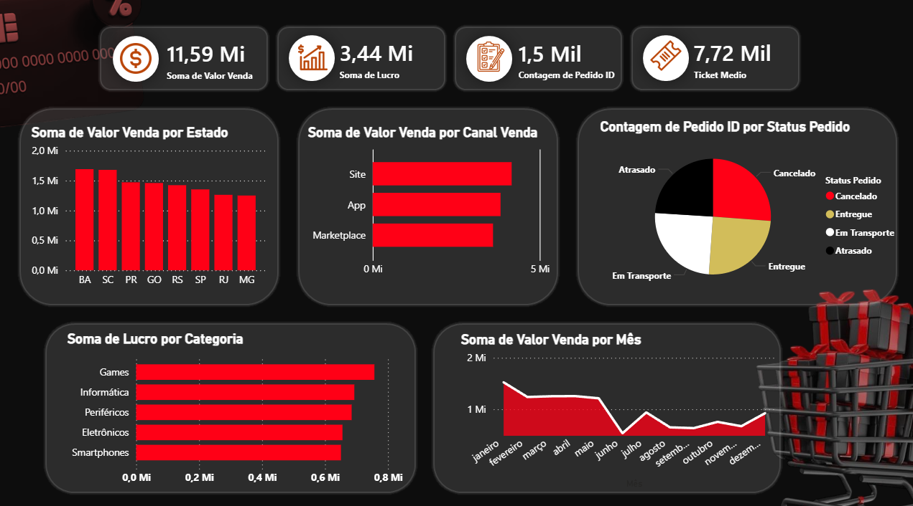
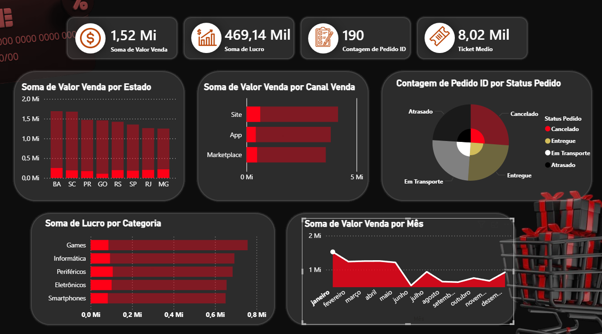

# Dashboard de E-commerce - Power BI

## Sobre o Projeto

Projeto desenvolvido em Power BI para análise de dados de e-commerce, utilizando uma base com mais de 1.500 registros.

## KPIs

* Faturamento Total
* Lucro Total
* Quantidade de Pedidos
* Ticket Médio

## Evolução das Vendas

## Análises Realizadas

* Faturamento por Estado
* Lucro por Categoria
* Vendas por Canal
* Status dos Pedidos
* Evolução das Vendas por Mês

## Ferramentas Utilizadas

* Power BI
* Excel
* DAX
* Business Intelligence

## Autor

Miqueias Soares da Silva

Estudante de Análise e Desenvolvimento de Sistemas com foco em Banco de Dados, SQL e Business Intelligence.
